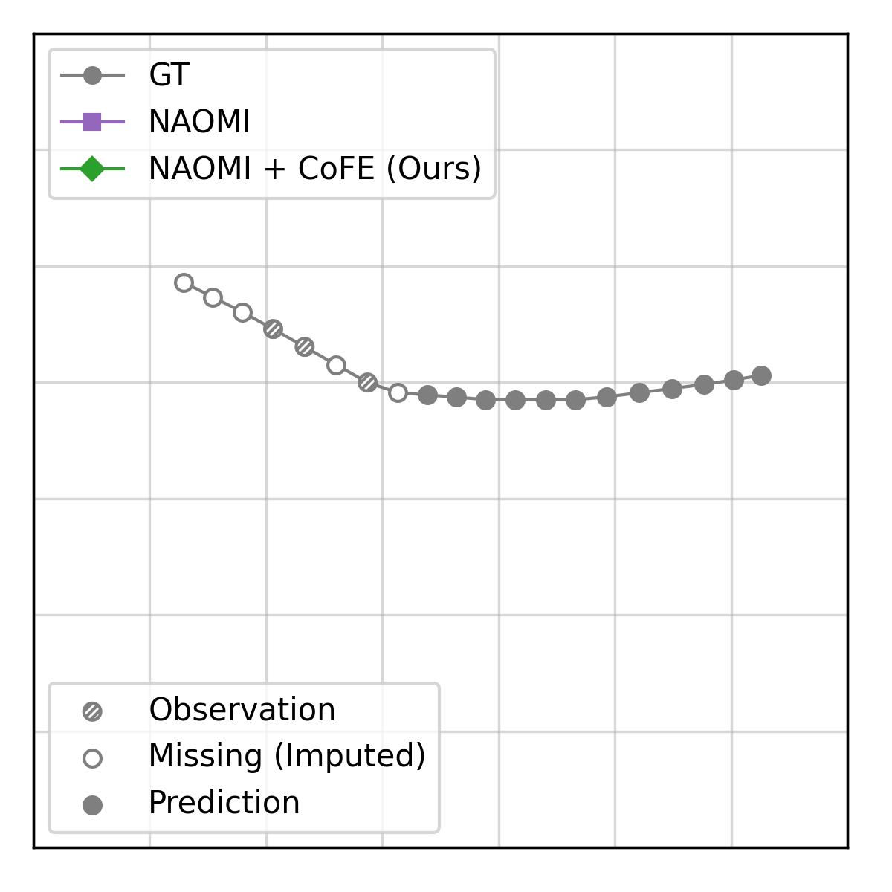

# T2FPV

Predicting pedestrian motion is essential for developing
socially-aware robots that interact in a crowded
environment. While the natural visual perspective for a
social interaction setting is an egocentric view, the
majority of existing work in trajectory prediction therein
has been investigated purely in the top-down trajectory
space. To support first-person view trajectory prediction
research, we present T2FPV, a method for constructing
high-fidelity first-person view (FPV) datasets given a
real-world, top-down trajectory dataset; we showcase our
approach on the ETH/UCY pedestrian dataset to generate the
egocentric visual data of all interacting pedestrians,
creating the T2FPV-ETH dataset. In this setting,
FPV-specific errors arise due to imperfect detection and
tracking, occlusions, and field-of-view (FOV) limitations
of the camera. To address these errors, we propose CoFE, a
module that further refines the imputation of missing data
in an end-to-end manner with trajectory forecasting
algorithms. Our method reduces the impact of such FPV
errors on downstream prediction performance, decreasing
displacement error by more than 10% on average. To
facilitate research engagement, we release our T2FPV-ETH
dataset and software tools.

## Dependency Installation
- Create a conda environment:
    - `conda create --name fpv python=3.7`
    - `conda install -c pytorch torchvision cudatoolkit=11.0 -c pytorch`
    - `cat requirements.txt | xargs -n 1 python -m pip install`
- In numpy/lib/format.py, ensure that pickle.dump has protocol=4

## Dataset Preparation

You can either download the raw data directly and follow the pre-processing steps below, or skip directly to downloading the already processed data. We *highly* recommend using the pre-processed data, as that is the process which generates the scenario IDs in the correct order for an eval.ai submission.

### Pre-Processed Data
- Download `input_data.pkl` from here: https://cmu.box.com/s/d5t0yyirtjjkodgreiv6r48yby4mtywv
    - Move the file into the `data/` folder, so that it becomes `data/input_data.pkl`
- Download the processed cache files here: https://cmu.box.com/s/gzaop5av0zsteotmfzyiwu6hgckbukh8
- Extract the `npy` files into the `data/processed` folder:
    - `tar -xvf processed.tar.gz; mv processed/* data/processed/.; rm processed.tar.gz`
    - This should result in the files appearing as, e.g., `data/processed/eth_*_pred-dets.npy`
- Note that these files contain only the ResNet extracted features from each ego frame. If you would like to re-process them, or save the actual images themselves, please see below for handling the raw data.

### Raw Data
- Download the raw data from the following link: https://cmu.box.com/s/tij0yyo8ulqh1n7uane0pf3onj7ror7f 
- Extract the files into the `data/` folder:
    - `tar -xvf FPVDataset.tar.gz; mv FPVDataset data/. ; rm FPVDataset.tar.gz`
- Run `python multi_run.py --run-type data` to construct the processed cache files for all the tracklets, data loaders, etc.
    - You can modify the `vrnntools/utils/datasets/fpv_dataset.py` script as desired to e.g. extract different version of ResNet features. Make sure to modify the `fpv_dataset_name` function to ensure the caching is overwritten appropriately.

## Running Experiments
- To test the install, run:
    - `python multi_run.py --exp-config config/fpv_noisy/vrnn.json --run-type data`
- You can then create your own trainer by
    - following the examples in `config/fpv_det_train/`
    - adding or modifying a trainer such as in `vrnntools/trajpred_trainers/sgnet_cvae.py`
    - updating `run.py::run_task(...)` to create the correct trainer object
- Alternatively, you could use the generated `.npy` files in `data/processed` to extract the data. Each `npy` file is a list of 3 Torch DataLoader objects, corresponding to the `train`, `val`, and `test` data loader. You can access the underlying data by accessing the `dataset` field of each of these objects, to retrieve instances of `FPVDataset`. Examine the `__getitem__` function therein to see what is returned.
    - Make sure to use the files `data/processed/*_fpv_hl-8_fl-12_hs-10_fs-10_sk-1_ag-2_bal_mdl-3_imgs_dets_align_resnet_hmatch_pred-dets.npy` 

### Submission to Eval AI
- See https://eval.ai/web/challenges/challenge-page/2086/evaluation for more info on terms and conditions
- For participation in the 2023 IROS workshop challenge, first train the 5 models as required:
    - `python multi_run.py --exp-config config/fpv_det_train/[YOUR CONFIG].json --run-type trainval`
    - This will output the predicted tensors in `out/*/det_train_*/trajs/`
- Then, run the following to generate the `submission.json` file to test against
    - `python submission_eval_ai.py --exp-config config/fpv_det_train/[YOUR FILE].json --output submission_test.npy`
    - This will process the outputted tensors from above into the correct format for eval.ai submission; examine the python script for more information
